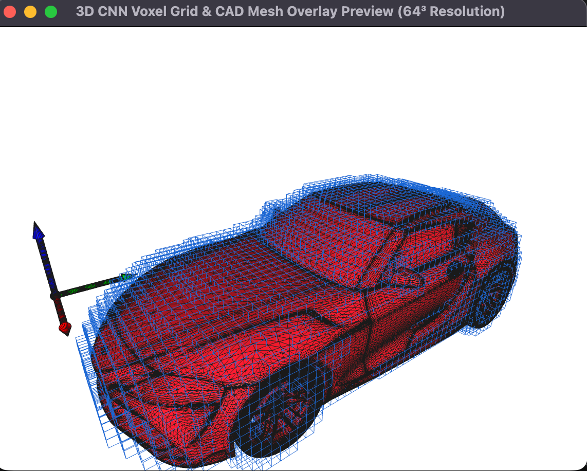
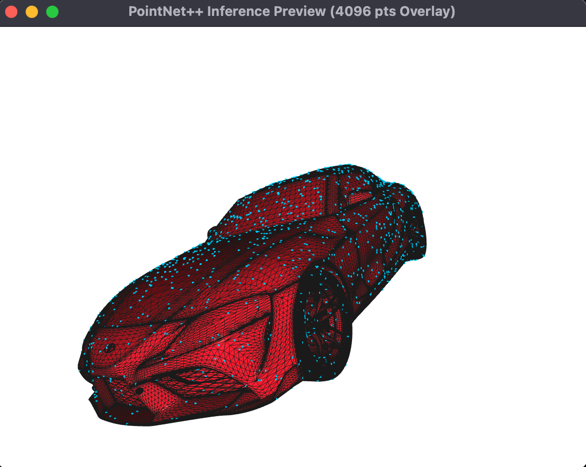

# Automotive Aerodynamic Drag (Cd) Prediction Pipeline

### Multi-Architecture Deep Learning with 3D CNN & PointNet++

This repository provides an end-to-end deep learning engineering pipeline to predict the Aerodynamic Drag Coefficient ($C_d$ value) of vehicle geometries directly from 3D CAD data (STL files). It implements two distinct geometric feature-extraction paradigms in PyTorch: a spatial **3D Convolutional Neural Network (3D CNN)** using voxel grids, and a geometric **PointNet++ (PointNet2)** model using raw surface point clouds.

## System Architectures

### 1. Voxel-Based 3D CNN Pipeline
* **Geometric Representation:** Fixed cubic voxel grids ($64^3$ or $128^3$ continuous binary states).
* **Core Logic:** Treats the geometric bounding box as an absolute macro environment. Best suited for mapping global body proportions and structural presence within a localized discrete box grid.
* **Visual Alignment Origin:** Locked to the absolute front-left lower floor corner of the computational volume boundary box.

### 2. Deep Geometric PointNet++ Pipeline
* **Geometric Representation:** Uniformly sampled surface node maps ($2048$ to $8192$ points).
* **Core Logic:** Utilizes Set Abstraction (SA) modules featuring Farthest Point Sampling (FPS) and Point Grouping Ball-Queries to extract granular, multi-scale localized flow-path features (such as canopy curvature or rear spoilers) directly from surface coordinates without spatial quantization loss.
* **Visual Alignment Origin:** Locked perfectly to the geometric centroid mass center along the X-Y axes, with the floor locked to $Z=0$.

### Requirements & Environments
The pipeline cleanly isolates its core math engine from interactive graphics binaries to maximize platform compatibility.

- **Core Prediction Pipeline:** Compatible with **Python 3.10 through Python 3.12+**. Operates completely headless and has minimal dependency requirements.
- **3D Visualization Feature (`--visualize`):** Powered by `open3d`. Due to upstream pre-compiled binary constraints within the Open3D ecosystem on newer runtimes, **Python 3.11** is highly recommended if you intend to use the interactive visualizer layer.

### Installation

Choose the installation tier that matches your active project objective:

#### Option A: Core Inference Only (Lightweight & Unconstrained)
Best for production environments, automated scripting, or systems running Python 3.12+. Installs only the baseline matrix engines and PyTorch frameworks.
```bash
pip install -r requirements.txt
```

#### Option B: Full Development & Visualization (Includes Open3D Engine)
Required if you want to launch the interactive 3D mesh and voxel grid alignment preview overlays.
```bash
pip install -r requirements-dev.txt
```

### Directory Structure

```text
cd-prediction-3dcnn/
├── data/
│   ├── processed_pcd/      # Cached normalized point clouds (.npy format)
│   ├── processed_voxels/   # Cached voxel matrices (.npy)
│   └── raw_stl/            # Input CAD geometry files (.stl)
├── models/
│   ├── cd_predictor_3dcnn_64.pth       # Trained 3D CNN weights baseline
│   └── cd_predictor_pointnet_4096.pth  # Trained PointNet++ structural weights
├── outputs/                # Generated visualization plots
│   ├── loss_history_pointnet.png   # Convergence curve for PointNet++ training
│   ├── loss_history.png            # Convergence curve for 3D CNN training
│   ├── prediction_accuracy_pointnet.png    #
│   └── prediction_accuracy.png     #
├── src/
│   ├── model_pointnet.py   # Pure PyTorch-Native PointNet++ layer stack
│   ├── model.py            # 3D CNN architecture
│   ├── predict_pointnet.py # Inference script for PointNet++ (Supports Open3D preview)
│   ├── predict.py          # Inference script for aerodynamic drag (Supports dynamic Open3D preview)
│   ├── preprocess_pointnet.py  # Farthest Point Sampling & node normalization
│   ├── preprocess.py       # STL alignment & voxelization logic
│   ├── train_pointnet.py   # Dataset loop and driver for PointNet++ training
│   ├── train.py            # Training loop with Apple Silicon (MPS) & CUDA 
│   ├── visualize_pointnet.py   # Open3D render wrappers for node-mesh fusion
│   └── visualize.py        # Standalone 3D Open3D overlay utility (Mesh + Voxel structural inspection)
├── dataset_meta.csv        # Metadata mapping filenames to true Cd values
├── make_dummy_stl.py       # Helper script to generate a primitive 3D box for pipeline preparation
├── README.md
├── requirements-dev.txt    # Full development suite including Open3D rendering packages
├── requirements.txt        # Production-grade dependencies for core CNN computation
└── test_run.py             # 64³ pipeline verification script with auto-downsampled terminal preview
```

## 1. Metadata Configuration (dataset_meta.csv)
Before running the training pipeline, prepare a dataset_meta.csv file in the root directory. This file maps your STL filenames to their respective ground-truth $C_d$ values (obtained from wind tunnel tests or CFD simulations).

#### Format Example

```csv
filename,cd_value
test_sphere.stl,0.47
toyota_supra.stl,0.30
```

## 2. Voxel-Based 3D CNN Pipeline Components

#### A. 3D Geometry Preprocessor
A data processing program that loads 3D CAD models and transforms them into standardized inputs optimized for deep learning.
- Description: Loads STL files using trimesh, performs rigid alignments (anchoring the lowest vehicle point to Z=0 for ground-clearance effects and centering the Y-axis for lateral symmetry), scales the geometry, and embeds it into a fixed-size cubic voxel grid.
- Key Features: Automates complex spatial transformations to ensure consistent orientation and positioning across various CAD exports.

#### Run
```bash
python src/preprocess.py
```

#### B. 3D Convolutional Neural Network
A neural network architecture engineered specifically for capturing spatial and volumetric characteristics of 3D objects.
- Description: Implements a deep 3D CNN (CdValuePredictor3D) featuring 4 sequential layers of 3D convolutions, batch normalization, and max pooling, culminating in a linear regression head.
- Key Features: Features robust spatial feature extraction, native handling of raw 3D voxels, and built-in dropout layers to effectively mitigate overfitting.

#### Run
```bash
python src/model.py
```

#### C. Production Training Pipeline
The core execution script that coordinates data loading, hardware acceleration, and optimization loops.
- Description: Orchestrates custom PyTorch DataLoaders to map file entries in `dataset_meta.csv` with raw STL files. Computes Mean Squared Error (MSE) to minimize variance against true $C_d$ values.
- Key Features: Features on-the-fly caching of multi-resolution `.npy` voxel matrices to eliminate redundant processing and natively leverages Apple Silicon GPU power via Metal Performance Shaders (MPS).

#### Pipeline Resolution Control
The architecture follows a single-source-of-truth configuration. You can globally scale the entire execution pipeline (including preprocessing, model architecture channels, and tensor shapes) by modifying the master constant at the top of `src/train.py`:

```python
# =========================================================
# MASTER CONTROL CONSTANT
# Change this single variable to scale between 64 and 128 pipeline
# =========================================================
GLOBAL_RESOLUTION = 64  # Toggle between 64 and 128 depending on your compute targets
```

#### Run
Once your target resolution is set, initiate the training sequence:
```bash
# Execute the training loop using the selected global resolution
python src/train.py
```

#### D. Production Inference Pipeline (Prediction)
An evaluation script to predict the aerodynamic drag coefficient of a brand-new, unseen CAD geometry using the trained model weights.
- Description: Takes an unlabelled STL file, passes it through the exact same alignment and voxelization pipeline, loads the trained `.pth` weight dictionary, and outputs the final predicted continuous $C_d$ value.
- Key Features: Pure inference setup (utilizing `torch.no_grad()`) optimized for fast evaluation during iterative vehicle design phases. It supports dynamic resolution scaling to instantly switch between benchmark environments.

#### Run
You can execute inference by targeting your new STL file. By default, the script processes at `64³` resolution using the standard weights:
```bash
# Predict using the default 64³ resolution setup
python ./src/predict.py --stl data/raw_stl/new_design_test.stl
```

To run inference using a high-fidelity 128³ trained pipeline, simply append the --res 128 argument. The script will automatically load the corresponding cd_predictor_3dcnn_128.pth weights and upscale the preprocessing container:
```bash
# Predict using the high-fidelity 128³ resolution setup
python ./src/predict.py --stl data/raw_stl/new_design_test.stl --res 128
```

#### 3D Interactive Inspection (Optional)
If you have installed the full development suite (requirements-dev.txt), you can overlay the original high-resolution CAD mesh with the downsampled 3D CNN voxel input matrix.
Simply append the --visualize flag to any execution command:
```bash
# Run 64³ inference and launch the Open3D evaluation window
python ./src/predict.py --stl data/raw_stl/toyota_supra.stl --visualize
```

<p align="left">

</p>
<em>Figure: Interactive Fusion Preview showcasing the original CAD mesh (Crimson Red) aligned perfectly inside the 3D CNN input grid (Blue Cubes).</em>

<small>🚘 3D Model Source: <a href="https://www.printables.com/model/22546-2020-toyota-supra" target="_blank">2020 Toyota Supra</a> by <a href="https://www.printables.com/@ShadowcraftDes_48872" target="_blank">Shadowcraft Designs</a> (Licensed under <a href="https://creativecommons.org/licenses/by/4.0/" target="_blank">CC BY 4.0</a>)</small>

- 	Controls: Once the window initializes, use Left-Click + Drag to rotate the viewport, and use the Mouse Wheel to zoom out and capture the full spatial alignment profile.

## Dataset Scaling & Training Roadmap
Below is the recommended configuration pipeline based on the number of available 3D CAD variants in your dataset:

| Dataset Size (STL Count) | Recommended Epochs | Target Batch Size | Expected Convergence & Behavior | Core Strategy & Focus |
| :--- | :--- | :--- | :--- | :--- |
| **1 ~ 10** <br>*(Sandbox / Test)* | 5 ~ 10 | 1 ~ 4 | High risk of negative predictions or complete overfitting to a single geometry profile. | Pipeline validation only. Verify that preprocessing alignments and GPU (MPS) tensors run without errors. |
| **50 ~ 100** <br>*(Early Prototype)* | 50 | 4 ~ 8 | Loss begins to decrease steadily. The model captures coarse feature differences (e.g., Sedan vs. SUV). | Establish a baseline validation score. Focus on stabilizing the variance using early dropout constraints. |
| **300 ~ 500** <br>*(Production Ready)* | 100 ~ 200 | 8_/_16 | Smooth loss convergence. The network accurately maps fine geometric changes to localized $C_d$ changes. | Hyperparameter tuning. Optimize learning rates and test deep spatial features for precise aerodynamic tracking. |

### Pipeline Verification (Quick Test)
A standalone test script (`test_run.py`) that generates a dummy geometric shape to validate the end-to-end preprocessing, grid alignment, and voxelization logic.
#### Run
To verify the pipeline health and render a visual 2D cross-section directly inside your terminal window.
```bash
python test_run.py
```

## 3. Deep Geometric PointNet++ Pipeline Components

This parallel pipeline processes raw surface coordinate nodes instead of discrete voxel boxes. By replacing heavy spatial quantization with multi-scale Set Abstraction modules, it extracts highly localized aerodynamic features (such as spoiler angles, roof slope transitions, and wing curvatures) directly from the vehicle's surface coordinates.

#### Preprocessing & Node Alignment Specifications
Unlike the voxel grid, which aligns to an absolute outer boundary corner, the PointNet++ pipeline applies an **Aerodynamic Mass-Centric Normalization** workflow via `src/preprocess_pointnet.py`:
1. **Centroid Alignment:** The vehicle geometry is automatically shifted so that its horizontal X-and-Y geometric mass center sits exactly at the `(0, 0)` spatial origin.
2. **Ground Clearance Lock:** The lowest point of the vehicle's bottom undercarriage/wheels is tightly locked onto the `Z = 0` baseline.
3. **Unit Scale Convergence:** The entire point cloud is uniformly scaled by the maximum bounding extent, fitting all coordinates cleanly within a localized unit context to ensure robust neural gradient propagation.

#### Sampling Pipeline & Cache Control
Generating representative spatial centers via Farthest Point Sampling (FPS) in real-time can become a bottleneck during multi-epoch training iterations. To maintain optimal efficiency, the pipeline implements an automated caching mechanism:
* Raw STL files are loaded and uniformly sampled across their triangular faces using `trimesh`.
* The resulting coordinate matrices are saved into a dedicated cache directory as compressed NumPy arrays, appended with their specific point density context (e.g., `_4096pts.npy` or `_8192pts.npy`).
* If a cache file matching the exact target point density is detected, the preprocessing stage is bypassed instantly to keep data loaders fully saturated.

#### The Master Control Constant
You can scale the resolution and target node density of your point cloud network by adjusting a single centralized global constant located at the top of `src/train_pointnet.py`:

```python
# =========================================================
# MASTER CONTROL CONSTANT
# Change this single variable to scale between 2048, 4096, or 8192 pipeline density
# =========================================================
GLOBAL_POINTS = 4096  # Target point cloud sampling density context
```
- 2048 Points: Ultra-lightweight setup. Extremely fast computation loop, ideal for debugging pipeline operations.
- 4096 Points: The recommended standard baseline. Captures prominent vehicle silhouettes and basic canopy profiles efficiently.
- 8192 Points: High-resolution mode. Captures fine-grain aerodynamic elements such as rear spoilers, splitters, and localized curvature transitions without choking the Apple Silicon MPS hardware.

#### How to Run: PointNet++ Pipeline
1. Model Training
To trigger the complete PointNet++ dataset loop, continuous feature extraction via custom Python-native Set Abstraction layers, and regression learning, execute:
```bash
python ./src/train_pointnet.py
```

2. Model Inference & Fusion Visualization
To run inference on an unseen target vehicle and instantly launch an interactive graphics overlay window displaying the sampled point nodes combined with the original translucent CAD mesh:
```bash
python ./src/predict_pointnet.py --stl data/raw_stl/toyota_supra.stl --points 4096 --visualize
```
<p align="left">

</p>
<em>Figure: Interactive Fusion Preview showcasing the uniformly sampled surface cloud nodes (Cyan Points) structurally synchronized over the source CAD geometry (Crimson Wireframe).</em>

### Inspiration & Research Background

The core architectural concept of leveraging spatial voxelization for automotive aerodynamic prediction was highly inspired by the methodology explored in the following research paper:

- **Paper Title:** *Prediction of Aerodynamic Forces on Car Shapes by Machine Learning Using Voxel Representation* (ボクセル表現を用いた機械学習による自動車形状の空気力予測)
- **Journal:** Trans. Soc. Automot. Eng. Jpn. (自動車技術会論文集), Vol. 52, No. 3, 2021.
- **Link:** [J-STAGE / DOI Link](https://www.jstage.jst.go.jp/article/jsaeronbun/52/3/52_20214248/_pdf)

- **Paper Title:** *Fluid drag prediction of 3D objects using point cloud neural networks* (点群ニューラルネットワークによる3次元物体の流体抗力予測)
- **Journal:** Trans. JSME (日本機械学会論文集), Vol. 91, No. 948, 2025.
- **Reference Link:** [J-STAGE / DOI Link](https://www.jstage.jst.go.jp/article/transjsme/91/948/91_25-00052/_pdf)

*Note: This repository is an entirely independent, original implementation developed from scratch using open-source utilities. It does not share code, data, or direct alignment with the aforementioned publication.*

### License
This project is licensed under the **MIT License**. It is open-source software, meaning anyone is free to use, modify, distribute, and implement it for both personal and commercial purposes (please refer to the `LICENSE` file for full details).
